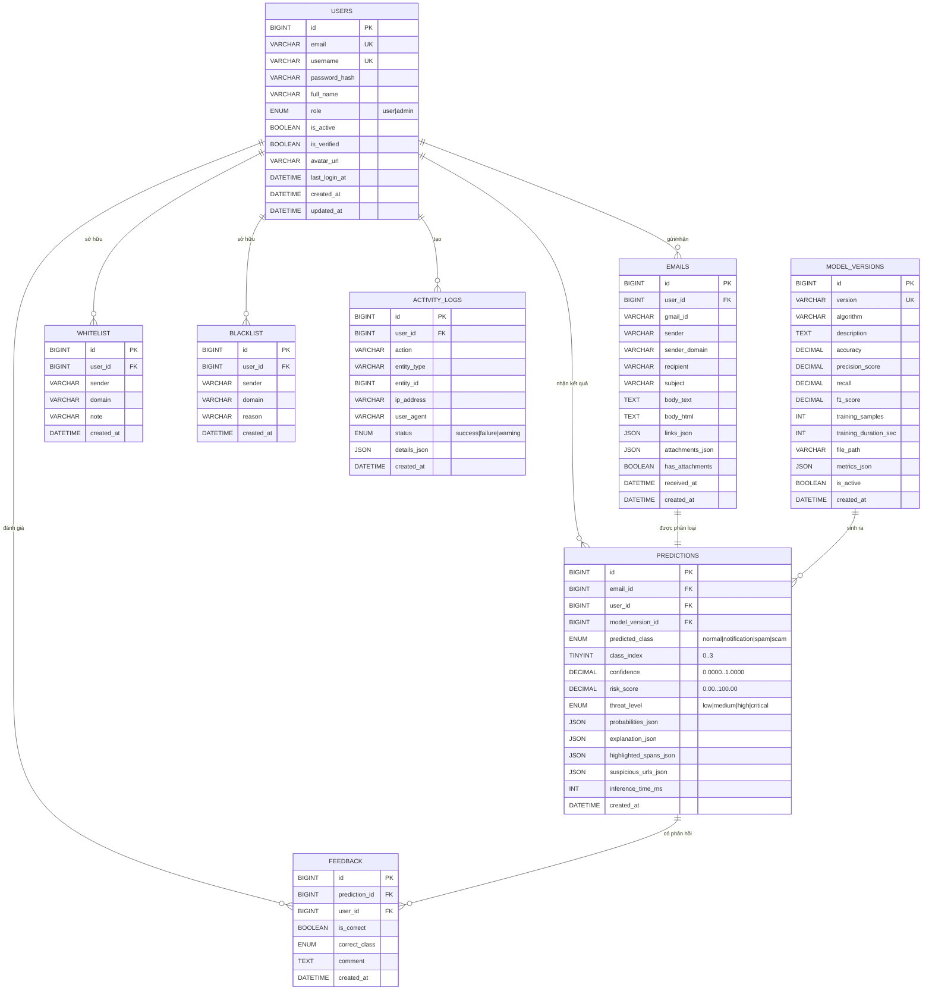

# Sơ đồ ER — MailGuard-AI

Sơ đồ thực thể - quan hệ (ER) cho hệ thống MailGuard-AI, gồm 8 bảng chính.

## Sơ đồ ER (Mermaid)

## Mô tả quan hệ

| Quan hệ | Loại | Mô tả |
|---------|------|-------|
| `users → emails` | 1-N | Một người dùng có nhiều email đã phân tích |
| `emails → predictions` | 1-1 | Mỗi email có đúng một dự đoán |
| `predictions → feedback` | 1-N | Một dự đoán có thể có nhiều phản hồi |
| `users → feedback` | 1-N | Người dùng đánh giá nhiều dự đoán |
| `users → whitelist` | 1-N | Danh sách tin cậy của người dùng |
| `users → blacklist` | 1-N | Danh sách đáng ngờ của người dùng |
| `model_versions → predictions` | 1-N | Một phiên bản mô hình sinh nhiều dự đoán |
| `users → activity_logs` | 1-N | Nhật ký hoạt động của người dùng |

## Chỉ mục (Indexes)

- Khóa chính (PK): tự động.
- Khóa ngoại (FK): tự động lập chỉ mục cho cột khóa ngoại.
- Khóa duy nhất (UQ): `users.email`, `users.username`, `model_versions.version`, `whitelist(user_id, sender)`, `blacklist(user_id, sender)`.
- Chỉ mục phụ: `emails.sender_domain`, `predictions.created_at`, `activity_logs.action`.

## File SQL

Xem file [`schema.sql`](./schema.sql) để lấy DDL đầy đủ.