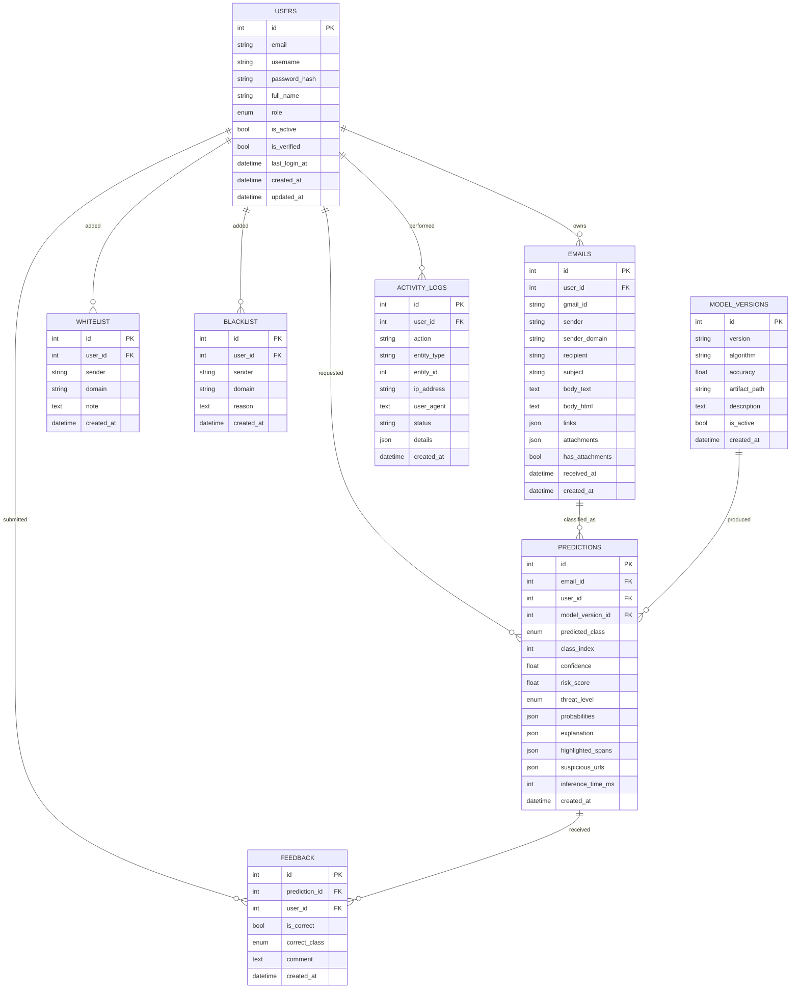

# MailGuard-AI — Entity-Relationship diagram

This document describes the conceptual schema. The physical schema lives
in `backend/alembic/versions/0001_initial.py` (SQLAlchemy + MySQL).

## Diagram (Mermaid)

## Class taxonomy (`predicted_class`)

| Index | Label | Meaning |
|-------|-------|---------|
| 0 | `normal` | Legitimate personal/work correspondence. |
| 1 | `notification` | Transactional / system messages (orders, alerts, reminders). |
| 2 | `spam` | Unsolicited marketing / bulk mail. |
| 3 | `scam` | Phishing, fraud, account takeover, malware. |

## Threat level (`threat_level`)

| Level | Risk score | Action |
|-------|-----------|--------|
| `low` | 0–24 | Informational banner. |
| `medium` | 25–49 | Warning banner. |
| `high` | 50–74 | Strong warning + suggested review. |
| `critical` | 75–100 | Hard block recommended. |

## Indexes (recommended)

- `users(email) UNIQUE`, `users(username) UNIQUE`
- `emails(user_id, created_at DESC)`
- `predictions(user_id, created_at DESC)`,
  `predictions(predicted_class)`, `predictions(email_id)`
- `feedback(user_id, created_at DESC)`
- `model_versions(is_active)` partial index (only one row is TRUE)
- `activity_logs(user_id, created_at DESC)`,
  `activity_logs(action, entity_type, entity_id)`

## Sample row counts (reference, varies by usage)

| Table | Typical size |
|-------|-------------|
| `users`         | 1–100s      |
| `emails`        | 100–100K per user |
| `predictions`   | 1:1 with `emails` |
| `feedback`      | ~10% of predictions |
| `whitelist/blacklist` | <100 per user |
| `model_versions`| <50 (audit only) |
| `activity_logs` | grows with traffic; consider 90-day retention |