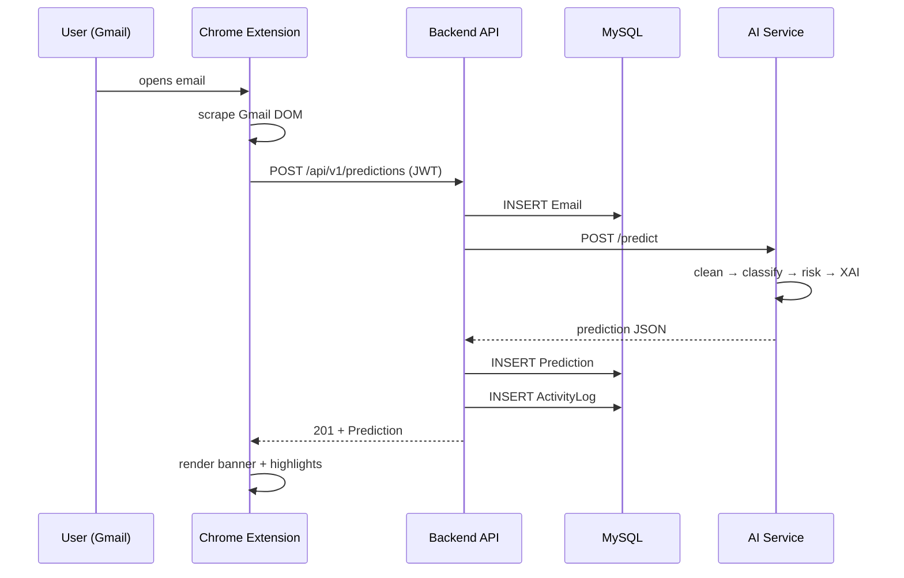
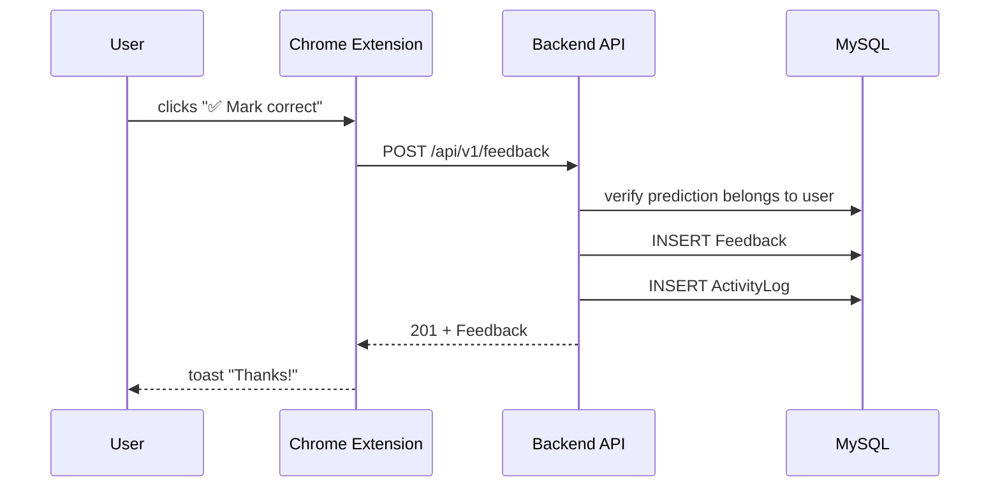
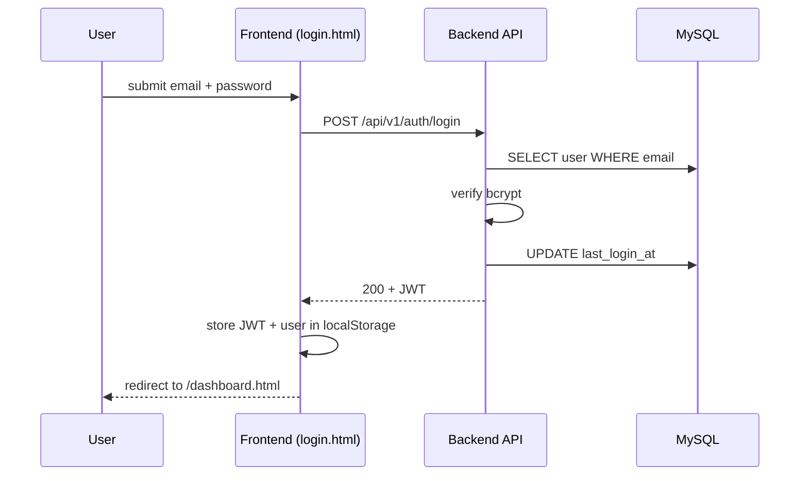
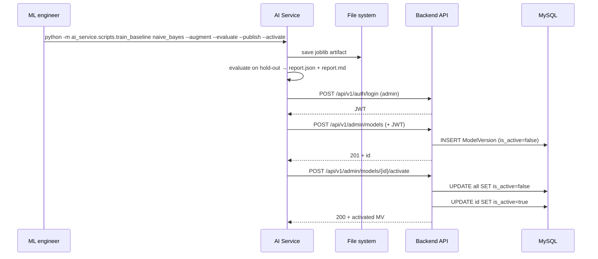
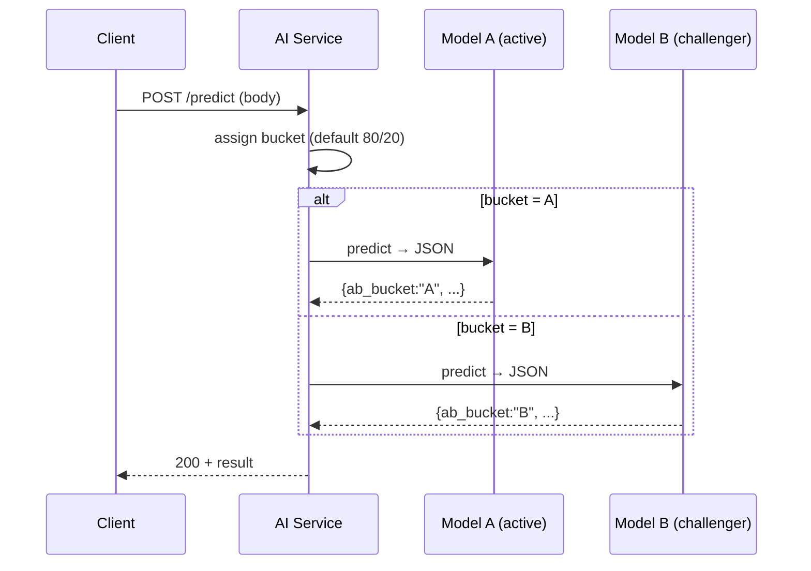
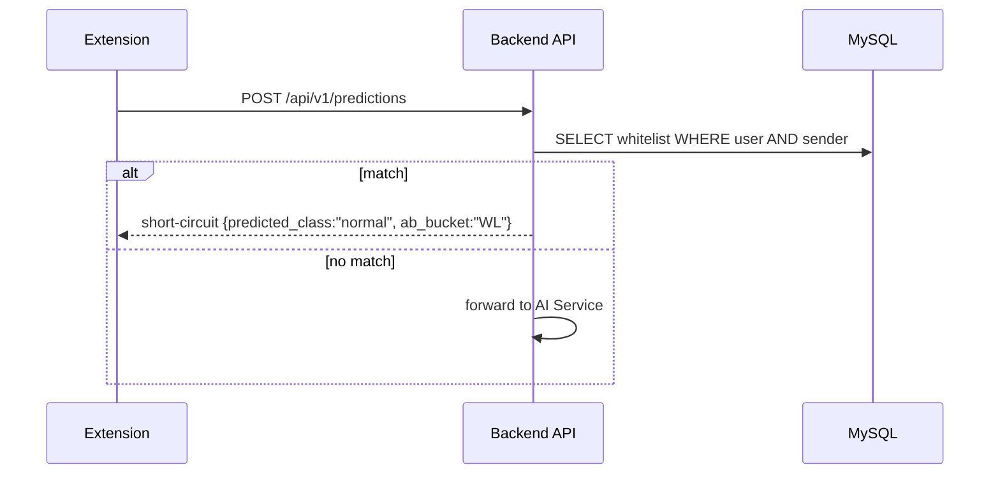

# MailGuard-AI — Sequence diagrams

## 1. End-to-end classification (UC-01)

## 2. Feedback submission (UC-02)

## 3. Login (UC-04-prep)

## 4. Publish model + activate (UC-05)

## 5. A/B testing request (UC-07)

## 6. Whitelist match (future enhancement)

